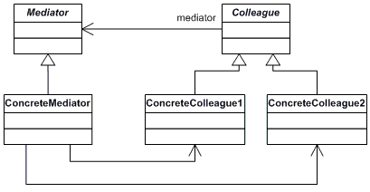

## Mediator Design Pattern

The Mediator design pattern defines an object that encapsulates how a set of objects interact. Mediator promotes loose coupling by keeping objects from referring to each other explicitly, and it lets you vary their interaction independently. 


## UML Class diagram




### Participants

1. **Mediator**: 
* Defines an interface for the communicating with the colleague classes

3. **Colleague classes**:
* Each colleague class knows its Mediator object
* These communicate with the mediator object instead of directly communicating with a colleague object, this approach enables loose coupling

### Running the project

* Use the dotnet cli to build the project
```
dotnet build
```

* Since this is a class library this is not a runnable file, so test it with 
```
dotnet test
```

